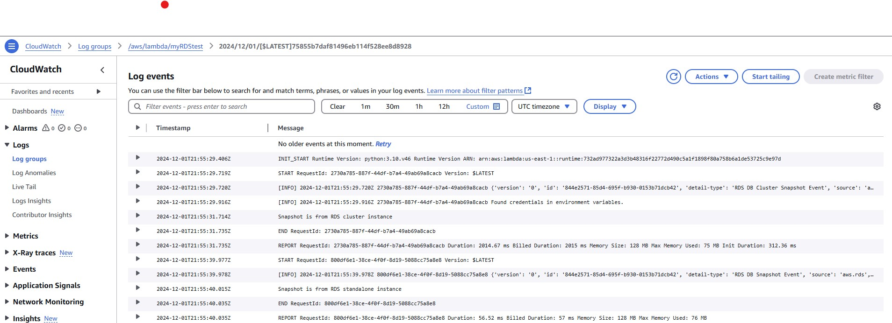

## Creating events and triggering lambda in AWS

In AWS, an event refers to a significant change or state transition in an AWS resource or service. AWS services generate events to signal changes in the state of resources, and these events can be captured and responded to by different AWS services. Events are crucial for enabling automation, monitoring, and notifications in cloud-based environments.

Key Concepts of AWS events:
1. Event Sources : service or a resource in AWS that generates events
2. Event Bridge : a service that allows to manage, capture and respond to events.
3. Event Types: 
	1. AWS Service Events : Generated by AWS Services when change in state e.g. startup, shutdown etc.
	1. CUstom Events : genegrated by users applications
	1. Scheduled Events: events that occur on a specified schedule 

4. Event Attributes: Events contain specific details about the action or state change that triggered the event which include source (e.g. aws.ec2, aws.s3 ..), Detail-type (description of event), time resources and other details.

### EventBridge Rules:
AWS EventBridge enables users to define event rules to filter specific types of events and route them to desired targets (such as Lambda functions, SNS topics, or SQS queues). This allows automated actions to be taken in response to particular events. For example:

Trigger a Lambda function when an EC2 instance starts.
Send an SNS notification when a new object is uploaded to an S3 bucket.  


Event eg.
```
##
## Event for standalone rds snapshot
##
{
  "source": ["aws.rds"],
  "detail-type": ["RDS DB Snapshot Event"],
  "detail": {
    "EventCategories": ["creation"],
    "SourceType": ["SNAPSHOT"]
  }
}
```

Event for cluster rds snapshot creation
```
##
## Event for cluster rds snapshot
##
{
  "source": ["aws.rds"],
  "detail-type": ["RDS DB Cluster Snapshot Event"],
  "detail": {
    "EventCategories": ["backup"],
    "SourceType": ["CLUSTER_SNAPSHOT"]
  }
}
```

A basic lambda function:
```
import json
import boto3

import logging

logger = logging.getLogger()
logger.setLevel(logging.INFO)

def lambda_handler(event, context):
    logger.info(event)
    srcrdsclient = boto3.client('rds')
    instType=event['detail']['SourceType']
    snapshot_id = event['detail']['SourceIdentifier'] 
    sourcearn = event['detail']['SourceArn']
    if instType == 'SNAPSHOT':
        print('Snapshot is from RDS standalone instance')
        message = f"SnapshotID : {snapshot_id}, ARN: {sourcearn}"
    elif (instType == 'CLUSTER_SNAPSHOT'):
        print('Snapshot is from RDS cluster instance')
        message = f"SnapshotID : {snapshot_id}, ARN: {sourcearn}"
    else:
        print('Unidentified Source')
        message = f"SnapshotID : NULL, ARN: NULL"

    return {
        'statusCode': 200,
        'body': message
    }
```

The logger is for our troubleshooting and can be omited when doing deployment in production.

Test Events to test the function:
```
##
## RDS Standalone
##
{
  "version": "0",
  "id": "844e2571-85d4-695f-b930-0153b71dcb42",
  "detail-type": "RDS DB Snapshot Event",
  "source": "aws.rds",
  "account": "123456789012",
  "time": "2018-10-06T12:26:13Z",
  "region": "us-east-1",
  "resources": ["arn:aws:rds:us-east-1:123456789012:snapshot:rds:snapshot-replica-2018-10-06-12-24"],
  "detail": {
    "EventCategories": ["creation"],
    "SourceType": "SNAPSHOT",
    "SourceArn": "arn:aws:rds:us-east-1:123456789012:snapshot:rds:snapshot-replica-2018-10-06-12-24",
    "Date": "2018-10-06T12:26:13.882Z",
    "SourceIdentifier": "snapshot-replica-2018-10-06-12-24",
    "Message": "Automated snapshot created",
    "EventID": "RDS-EVENT-0091"
  }
}

##
## RDS Cluster
##
{
  "version": "0",
  "id": "844e2571-85d4-695f-b930-0153b71dcb42",
  "detail-type": "RDS DB Cluster Snapshot Event",
  "source": "aws.rds",
  "account": "123456789012",
  "time": "2018-10-06T12:26:13Z",
  "region": "us-east-1",
  "resources": ["arn:aws:rds:us-east-1:123456789012:snapshot:rds:snapshot-replica-2018-10-06-12-24"],
  "detail": {
    "EventCategories": ["backup"],
    "SourceType": "CLUSTER_SNAPSHOT",
    "SourceArn": "arn:aws:rds:us-east-1:123456789012:snapshot:rds:snapshot-replica-2018-10-06-12-24",
    "Date": "2018-10-06T12:26:13.882Z",
    "SourceIdentifier": "mysql-instance-2018-10-06-12-24",
    "Message": "Creating manual cluster snapshot",
    "EventID": "RDS-EVENT-0074"
  }
}
```

Execution Logs:

